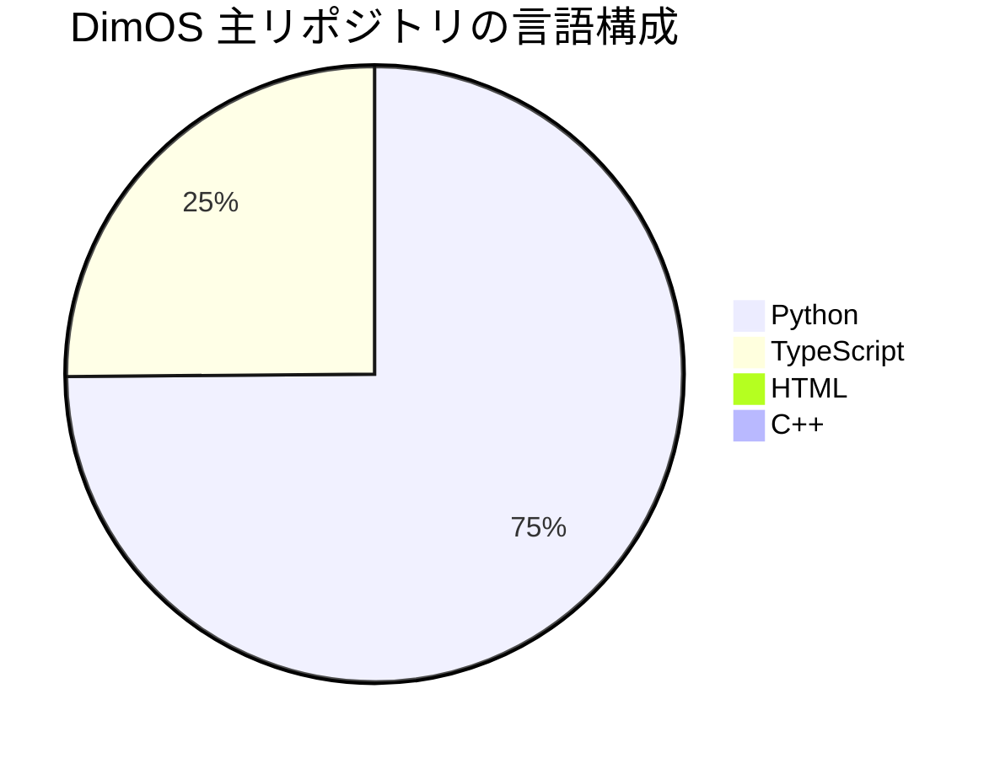

# DimOS 技術スタック完全棚卸しレポート

> DimOSリポジトリ（GitHub: dimensionalOS/dimos）の技術スタックをREADME・docs・ソースツリー・依存関係ファイル・Dockerfile群・GitHub Actions・ビルドスクリプト・リリースノートを対象に網羅的に棚卸したレポート。

## エグゼクティブサマリー

- DimOSは **Pythonを中核にしたロボティクスOS／エージェント実行基盤** であり、TypeScript系のUI、C++ネイティブ拡張、ROS2／Dockerベースの周辺実行環境が重なった多層スタック
- GitHub言語比率：**Python 74.5%、TypeScript 25.0%、HTML 0.4%、C++ 0.1%**
- 依存関係管理：`pyproject.toml` + `uv`、ビルドは setuptools / wheel / pybind11
- 実行時Python：`>=3.10`、リポジトリ既定は **Python 3.12**
- 通信レイヤーは **LCM が既定の高速 pub/sub**。代替として SharedMemory、ROS transport、Redis transport、DDS transport
- エージェント実行面では **MCP server / MCP client** が HTTP ツール公開面を担い、Web 側では FastAPI / Uvicorn / SSE と Foxglove 向け WebSocket 可視化が併存
- **DDS は一枚岩ではない**：CycloneDDS（optional extra）vs FastDDS / rmw_fastrtps_cpp（ROS ナビゲーションコンテナ）で文脈によって実装が分かれる



---

## 調査範囲と判定基準

- **確認済み**：依存宣言・ソースimport・ドキュメント・Docker/CIのいずれかで一次ソース確認できたもの
- **代替候補補あり**：複数 viewer / transport / LLM provider のように明示的な選択肢があるもの
- **未指定**：今回確認した一次ソース群に宣言依存も実装痕跡も見当たらないもの

---

## カテゴリ別全体マップ

| カテゴリ | 確認できた技術 | 主要位置 |
|---|---|---|
| 言語 | Python, TypeScript, HTML, C++ | repo言語比率・ツリー |
| Pythonランタイム | Python `>=3.10`、既定 `3.12` | `pyproject.toml`, `.python-version` |
| Pythonビルド | setuptools, wheel, pybind11, C++拡張 | `pyproject.toml`, `setup.py` |
| 依存管理 | uv, pip | install docs, tests workflow, pre-commit hook, installer |
| フロントエンド | npm, package-lock, Vite, Svelte, Tailwind, PostCSS, TypeScript | `dimos/web/dimos_interface/*`, `dimos/web/command-center-extension/*` |
| 通信/輸送 | LCM, SharedMemory, ROS, DDS, Redis, MCP/HTTP | docs/usage/transports/, `rosnav.py` |
| データ保存 | InMemory, SQLite, PickleDir, PostgreSQL, Chroma optional | `dimos/memory/timeseries/*`, `pyproject.toml` |
| Web/API | FastAPI, Uvicorn, SSE, Flask, Jinja templates, Foxglove WebSocket | `dimos/web/fastapi_server.py`, `flask_server.py` |
| 可視化 | Rerun SDK, dimos-viewer, Foxglove, browser dashboard | `pyproject.toml`, `docs/usage/visualization.md` |
| AI/LLM | LangChain, OpenAI, Anthropic, Ollama, HuggingFace, Whisper, Chroma | `pyproject.toml`, agents docs, env file |
| ロボティクス/ML | OpenCV, Open3D, Pinocchio, Drake, MuJoCo, Ultralytics, Transformers, Moondream, xArm, Piper, Unitree, MAVLink | `pyproject.toml`, release notes, navigation Dockerfile |
| コンテナ/配備 | Docker, Docker Compose, GHCR, self-hosted GitHub Actions | `docker/*`, `.github/workflows/*` |
| 認証/認可 | API keysは確認、サーバー認証フレームワークは**未指定** | `default.env`, CLI/MCP docs |
| メトリクス/トレーシング | JSONLログ, dtop, coverage は確認。Prometheus/OTelは**未指定** | CLI docs, release notes, workflows |

### アーキテクチャ概略図

```
CLI[dimos CLI / humancli / agent-send]
AGENT[Agent / MCP Client / LangGraph系 + LLM connector]
MOD[Blueprints / Modules / ModuleCoordinator]
STREAM[Streams]
TRANS[Transports: LCM / SharedMemory / ROS / DDS / Redis]
DATA[TimeSeriesStore: InMemory / SQLite / PickleDir / PostgreSQL]
VIEW[Visualization: Rerun / dimos-viewer / Foxglove / Web]
HW[Robot / Simulation: Unitree / xArm / Piper / Drone / MuJoCo]

CLI --> MOD
CLI --> AGENT
AGENT --> MOD
MOD --> STREAM
STREAM --> TRANS
MOD --> DATA
AGENT --> DATA
TRANS --> VIEW
TRANS --> HW
```

---

## 実装スタック詳細

### コア基盤・輸送・データ層

| 技術 | 版 | 役割/用途 | 主要位置 |
|---|---|---|---|
| Python | `>=3.10`, 既定 `3.12` | メイン実装言語 | `pyproject.toml`, `.python-version` |
| setuptools / wheel | `setuptools>=70`, `wheel` | Pythonパッケージビルド | `pyproject.toml` |
| pybind11 | `>=2.12` / setup では `>=2.13.6,<4` | C++拡張ビルド | `pyproject.toml`, `setup.py` |
| C++ extension | 未指定 | A* planner ネイティブ拡張 | `dimos/navigation/replanning_a_star/min_cost_astar_cpp.cpp` |
| uv | 未指定 | Python依存解決・lock管理・CIセットアップ | install docs, tests workflow, pre-commit hook |
| pip | 未指定 | ライブラリ利用者向けインストール | install docs, Nix docs |
| Nix / flakes | 未指定 | 非Debian Linux向け開発環境供給 | `flake.nix`, `flake.lock`, `docs/installation/nix.md` |
| RxPY | `reactivex` | モジュール間のリアクティブstream処理 | `pyproject.toml`, `fastapi_server.py`, `flask_server.py`, `rosnav.py` |
| Pydantic / pydantic-settings | `pydantic`, `>=2.11.0,<3` | 設定・型ベース構成 | `pyproject.toml`, CLI docs |
| LCM | `dimos-lcm`, `lcm`, PyTurboJPEG併用 | **既定の高速 pub/sub**、typed channel、UDP multicast | docs/usage/transports/index.md, `rosnav.py` |
| SharedMemory | 未指定 | 同一マシン向け最高速IPC | `docs/usage/transports/index.md` |
| ROS transport | 未指定 | ROS2トピックとの接続 | `docs/usage/transports/index.md`, `rosnav.py` |
| DDS transport | `cyclonedds>=0.10.5` | 純粋DDS transport extra | `pyproject.toml`, `docs/usage/transports/dds.md` |
| FastDDS / rmw_fastrtps_cpp | 未指定 | ROS2 navigationコンテナ側のDDS実装 | `docker/navigation/Dockerfile`, `docker/navigation/docker-compose.yml` |
| Redis transport | 未指定 | network pubsubの代替transport | `docs/usage/transports/index.md` |
| MCP server / client | port `9990` 既定 | スキルのHTTPツール公開、外部agent連携 | `docs/usage/cli.md`, `docs/capabilities/agents/readme.md` |
| SQLite | 未指定 | TimeSeriesStoreの単一ファイル永続化 | `dimos/memory/timeseries/sqlite.py` |
| PostgreSQL | port `5432`, DB `dimensional` 既定 | TimeSeriesStoreのDB backend | `dimos/memory/timeseries/postgres.py`, `psql` extra |
| InMemory | 未指定 | テスト/簡易実行向けstore | `dimos/memory/timeseries/inmemory.py` |
| PickleDir | 未指定 | ファイルベース保存 | `dimos/memory/timeseries/pickledir.py` |
| Chroma / langchain-chroma | `>=1,<2` | エージェント記憶のvector store候補 | `pyproject.toml`, release v0.0.10 notes |
| キャッシュ層 | **未指定** | Redis/Memcachedのような汎用キャッシュは不明 | — |

---

### AI・ロボティクス・シミュレーション層

| 技術 | 版 | 役割/用途 |
|---|---|---|
| NumPy / SciPy | `>=1.26.4`, `>=1.15.1` | 数値計算の基盤 |
| OpenCV | 未指定 / `opencv-contrib-python==4.10.0.84` | 画像処理、Web stream、JPEG化、知覚系 |
| Open3D | `>=0.18.0`, arm は `open3d-unofficial-arm`; nav imageで `v0.19.0` source build | 3D点群/幾何処理 |
| Numba / llvmlite | `>=0.60.0`, `>=0.42.0` | occupancy map計算など高速化 |
| Pinocchio | `pin>=3.3.0` | IK / manipulation / teleop の運動学 |
| Drake | `>=1.40.0`, macOS非armは `==1.45.0` | manipulation planning, FK/IK, RRT |
| MuJoCo | `>=3.3.4` | ロボットシミュレーション |
| LangChain系 | `langchain==1.2.3`, `langchain-core==1.2.3`, OpenAI/HF/Ollama/Text splitters/Chroma | agent orchestrationとmodel connector |
| OpenAI | `openai`, `langchain-openai`, default model `gpt-4o` | 既定LLM、Whisper/TTS/STT含む |
| Anthropic | `anthropic>=0.19.0` | 代替LLM provider |
| Ollama | `ollama>=0.6.0`, docs example `ollama:llama3.1` | ローカルLLM |
| HuggingFace | `langchain-huggingface`, `HUGGINGFACE_*` env vars | model/endpoint利用 |
| Whisper / sounddevice / soundfile | 未指定 | 音声入出力・STT/TTS |
| Ultralytics / Transformers / Moondream | `ultralytics>=8.3.70`, `transformers[torch]==4.49.0`, `moondream`, etc. | object detection, VLM, tracking/config |
| Unitree WebRTC | `unitree-webrtc-connect-leshy>=2.0.7` | Unitree実機接続 |
| xArm SDK / Piper SDK / pyrealsense2 | `xarm-python-sdk>=1.17.0`, `piper-sdk`, `pyrealsense2` | manipulation hardware SDK |
| pymavlink | 未指定 | drone extra |
| Google Maps API | `googlemaps>=4.10.0` | GPS / map query skills |
| Cerebras Cloud SDK | `cerebras-cloud-sdk`, `tensorzero==2025.7.5`, `portal`, `xrpl-py>=4.0.0,<5` | 現行repo内での用途詳細は**未指定** |

---

### Web・UI・観測・開発体験

| 技術 | 版 | 役割/用途 |
|---|---|---|
| FastAPI | `>=0.115.6` | Web API / video feed / text stream / form submit |
| Uvicorn | `>=0.34.0` | FastAPI server runtime |
| SSE Starlette | `>=2.2.1` | browser text stream push |
| Flask | 未指定 | 旧来/代替 Web stream server |
| Foxglove | 未指定 | visualization / control UI |
| Rerun SDK | `>=0.20.0` | 3D/マルチモーダル可視化 |
| dimos-viewer | `>=0.30.0a2` (visualization extraは `>=0.30.0a4`) | native viewer（Rerun fork）、**最新既定** |
| Svelte | `^4.2.8` | dimos_interface frontend framework |
| Vite | `^5.0.13` | frontend build / dev server |
| Tailwind / PostCSS / Autoprefixer | `^3.4.0`, `^8.4.32`, `^10.4.16` | frontend styling pipeline |
| TypeScript | `^5.2.2` | frontend実装言語 |
| Node.js | dev containerは `24`, Svelte appは `>=18.17.0` | frontend/tooling runtime |
| CLI stack | Typer `>=0.19.2,<1`, Textual `==3.7.1`, plotext `==5.3.2`, terminaltexteffects `==0.12.2` | TUI/CLI |
| Structlog / colorlog | `structlog>=25.5.0,<26`, `colorlog==6.9.0` | 構造化ログ/人間向けログ |
| dtop / lcmspy / agentspy / coverage | 未指定 / `coverage>=7.0` | リソース監視、トピック観察、agent監視、テスト計測 |
| 認証・認可 | **未指定** | API keyはあるがWeb/MCP server authはrepo内で未確認 |
| メトリクス / 分散トレーシング | **未指定** | Prometheus/OpenTelemetryなどの宣言依存は未確認 |

---

## コンテナ化と CI/CD

DimOSのコンテナ構成は単一イメージではなく、**多段かつ役割分離されたチェーン**。

| コンポーネント | ベース/版 | 役割 |
|---|---|---|
| `docker/ros` | ubuntu:22.04, `ROS_DISTRO=humble` 既定 | ROS2基盤image |
| `docker/python` | `FROM ghcr.io/dimensionalos/ros:dev` | Pythonツールチェーン image |
| `docker/dev` | `FROM ghcr.io/dimensionalos/ros-python:dev` | 開発用インタラクティブ image |
| `docker/navigation` | `osrf/ros:${ROS_DISTRO}-desktop-full` または `ros:${ROS_DISTRO}-ros-base` | ROS autonomy stack統合 image（Humble/Jazzy, Open3D arm build, OR-Tools, Sophus, Ceres, GTSAM, colcon, FastDDS） |
| navigation compose | simulation / hardware / bagfile profiles | 実行モード切替、GPU/host networking、Foxglove bridge |
| installer | `INSTALLER_VERSION="0.3.0"` | 対話型 install（Ubuntu/macOS） |

### CI/CD

- **GitHub Actions + self-hosted runner**
- image registry は **GHCR**
- ローカル/実機の起動は **Compose と shell script** が中心
- Kubernetes / Helm / Terraform / Pulumi は今回確認したリポジトリ範囲では見つかっていない

---

## 未指定・要確認項目

| 項目 | 状態 | 優先度 |
|---|---|---|
| 認証・認可フレームワーク（JWT/OAuth等） | 未指定（API keyのみ確認） | 高 |
| 汎用キャッシュ（Redis/Memcached） | 未指定 | 中 |
| Prometheus / OpenTelemetry系observability | 未指定 | 中 |
| Kubernetes級オーケストレーション | 未確認 | 低 |
| Chroma の current mainでの実利用状況 | source importベースで要確認 | 中 |
| Redis transport / DDS transport の実運用状況 | ドキュメント記載はあるが実装確認要 | 中 |

---

## 最終確認優先コマンド

```bash
git clone https://github.com/dimensionalOS/dimos.git
cd dimos

# マニフェスト類を列挙
find . -type f \
  \( -name 'pyproject.toml' -o -name 'setup.py' -o -name '.python-version' \
    -o -name 'package.json' -o -name 'package-lock.json' \
    -o -name 'Dockerfile' -o -path './.github/workflows/*.yml' \
    -o -name 'flake.nix' -o -name 'flake.lock' \) | sort

# pyproject から依存関係を抽出
python - <<'PY'
import tomllib, pathlib, json
data = tomllib.loads(pathlib.Path("pyproject.toml").read_text())
print("requires-python:", data["project"].get("requires-python"))
print("\ncore dependencies:")
for dep in data["project"]["dependencies"]:
    print("  -", dep)
print("\noptional dependencies:")
for group, deps in data["project"]["optional-dependencies"].items():
    print(f"[{group}]")
    for dep in deps:
        print("  -", dep)
PY

# 通信・可視化・外部 API の痕跡
rg -n \
  'LCMTransport|ROSTransport|cyclonedds|rmw_fastrtps_cpp|FastAPI|Flask|uvicorn|foxglove|rerun|langchain|anthropic|openai|googlemaps|psycopg2|sqlite3|redis' \
  dimos docs docker .github pyproject.toml
```

---

## まとめ

> DimOSの現時点の技術スタックは、**Pythonを中心のロボティクスOSに、LCM/ROS/DDS/SharedMemoryの多輸送設計、LangChain系エージェント統合、Rerun/Foxglove/Web UIの複数可視化面、Docker/ROS実機統合、TimeSeriesStoreによる複数永続化backendを重ねたもの**。
> 
> 逆に、認証・認可、汎用キャッシュ、Prometheus/OTel系observability、Kubernetes級orchestrationは、このリポジトリ単体ではまだ主要要素になっていない。
