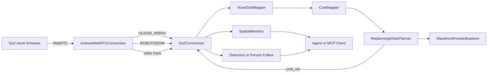
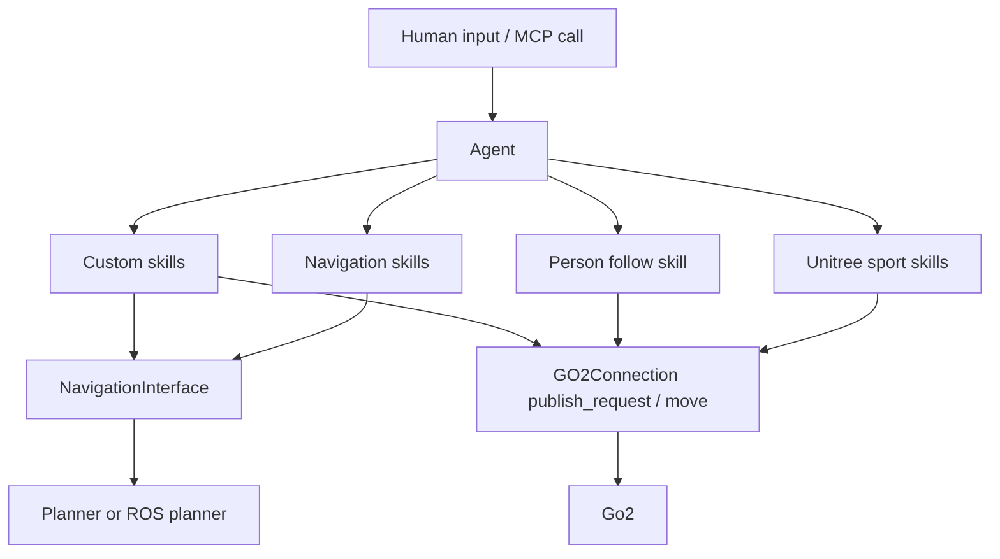

# DimOSとUnitree Go2で今できることと高精度SLAM・エージェント化の実装指針

> [!summary] エグゼクティブサマリー
> `dimos run unitree-go2` まで到達しているなら、**DimOSの現行Go2スタックは「すぐ動く非ROSネイティブなマッピング・探索・エージェント実行基盤」として非常に強い**。一方、高精度SLAMの中心要件である **loop closure** や厳密な時刻整合を前提にした **LiDAR-IMU融合の土台は、まだ発展途上**。
>
> 最も現実的な推奨方針：**DimOSを「Go2センサ＋エージェント実行基盤」として温存し、SLAMだけをROS 2 sidecarに外出しする構成**。

---

## 今のDimOSとGo2で実際に何ができるか

DimOSのGo2系blueprintは単なる「歩行ラッパー」ではない。公開コードには少なくとも：

- 非ROSネイティブの自律探索スタック
- 3D検出・空間記憶
- LLMエージェント・MCP・時系列記憶
- ROSブリッジ

まで枝分かれしている。Go2はDimOSの **primary reference platform** とされており、「full autonomous navigation, mapping, and agentic control — no ROS required」と明記されている。

### Blueprint 一覧と用途

| Blueprint | 主用途 | 実装の中身 | 使うタイミング |
|-----------|--------|-----------|--------------|
| `unitree-go2-basic` | Go2接続と可視化の最小構成 | `go2_connection()`、`websocket_vis()`、viewer/transport構成 | センサ取得・可視化・通信確認の基礎 |
| `unitree-go2` | 非ROSの標準探索スタック | `voxel_mapper(voxel_size=0.1)`、`cost_mapper()`、`replanning_a_star_planner()`、`wavefront_frontier_explorer()` を追加 | 「今のDimOSで何ができるか」を確認する標準入口 |
| `unitree-go2-detection` | 3D検出を追加 | `Detection3DModule` を接続し検出結果や注釈をLCM transportで出す | 物体検出やscene updateが必要なとき |
| `unitree-go2-ros` | ROS 2 topicへの橋渡し | `lidar`、`global_map`、`odom`、`color_image` をROSTransportに再束縛 | 外部SLAM・外部plannerと段階的に統合するとき |
| `unitree-go2-spatial` | 空間記憶つき | `spatial_memory()` と `PerceiveLoopSkill` を追加 | 「場所の記憶」と自然言語検索の土台が欲しいとき |
| `unitree-go2-agentic` | LLMエージェント | `unitree_go2_spatial` に `agent()` と `_common_agentic` を追加 | 自然言語でGo2を動かしたいとき |
| `unitree-go2-agentic-mcp` | 外部ツール連携 | `McpServer` と `mcp_client()` を追加 | Claude Code / Cursor / MCPクライアントから操作したいとき |
| `unitree-go2-agentic-ollama` | ローカルLLM | `agent(model="ollama:qwen3:8b")` を使う | OpenAI APIを使わずローカルモデルで試したいとき |

### Agentic構成で有効なスキル

`_common_agentic` では以下が接続済み：

- `navigation_skill()` — 場所のタグ付け・自然言語による場所検索・見えている対象への接近・意味地図からの検索
- `person_follow_skill()` — VL model・EdgeTAM・visual servoing / 3D navigationを使った人物追従
- `speak_skill()`、`web_input()` など

`unitree_skills` 側には `relative_move`、`wait`、`current_time`、`execute_sport_command`（StandUp、StandDown、BodyHeight、SwitchGait、ContinuousGait、FrontJump、FrontFlip など高位モーション）が定義されている。

---

## 現在のGo2スタックの内部構成と精度面の限界

### データフロー



### 精度面の限界

> [!warning] 現状のSLAM精度の根本問題
> 1. **loop closure なし** — native mapperはodomとvoxel統合ベースの非ROSネイティブな探索スタック。本格的なloop closure前提の3D SLAMはこれから。
> 2. **WebRTC LiDAR timestampが broken** — `pointcloud2_from_webrtc_lidar()` のコメントでWebRTCのLiDAR stampは壊れているとされ、受信時刻へ置換している。厳密なセンサ融合や高精度SLAMには不利。
> 3. **デフォルトvoxel解像度が粗い** — `VoxelGridMapper` のdefaultは5cm、実際のGo2 blueprintは `voxel_size=0.1`（10cm）で動く。狭い屋内や細い障害物の表現力は落ちる。

**SLAM精度を本気で詰めるなら、センサ入力系をWebRTCから外す価値がかなり高い。**

---

## 重要ファイル一覧

| ファイル | 役割 | 変更する場面 |
|---------|------|------------|
| `dimos/robot/unitree/go2/connection.py` | Go2ConnectionのGo2 streamとcmdをDimOS moduleに変換。standup/liedown/observeもここ | 低遅延化、camera_info修正、lowstate露出、起動/停止挙動変更 |
| `dimos/robot/unitree/connection.py` | WebRTC実接続。AI mode切替、ULIDAR_ARRAY/ROBOTODOM/video/LOW_STATE購読 | WebRTCをやめてDDS/SDK2系へ切り替える、時刻同期調整 |
| `dimos/robot/unitree/go2/blueprints/basic/unitree_go2_basic.py` | 基本構成。viewer/transportもここ | 「まずROS sidecarに何を出すか」を決める最初の差分点 |
| `dimos/robot/unitree/go2/blueprints/smart/unitree_go2.py` | native nav合成点 | native SLAM/mapperをやめて外部SLAMに切り替えるときの中心 |
| `dimos/mapping/voxels.py` | Open3D VoxelBlockGridベースのglobal mapper。column carving実装 | voxel分解能、publish interval、column carvingを調整するとき |
| `dimos/mapping/costmapper.py` | OccupancyGrid生成 | planner入力のcostmapを変えたいとき |
| `dimos/navigation/replanning_a_star/module.py` | NavigationInterface実装。goal/cancel/goal_reached | 外部plannerに置換するときの参照実装 |
| `dimos/navigation/frontier_exploration/wavefront_frontier_goal_selector.py` | frontier探索 | 探索方策を改善したいとき。現行アルゴリズムの改善issueあり |
| `dimos/perception/spatial_perception.py` | spatial memory。画像埋め込み＋位置メタデータを保存 | semantic navigationやlocation memoryを強化したいとき |
| `dimos/robot/unitree/unitree_skill_container.py` | robot skills。`relative_move`やsport command | Go2固有の新しいtool/skillを追加するとき |
| `dimos/agents/agent.py` と `AGENTS.md` | skillをLangGraph toolに変換し、agentとして実行 | エージェント拡張、tool schema設計、MCP統合時 |

---

## 高精度SLAMに置き換えるなら、どのルートが現実的か

### ルート比較

| 候補 | 向いているゴール | 強い点 | 注意点 | 位置づけ |
|------|----------------|--------|--------|---------|
| DimOS native改良 | 今すぐ改善、変更最小 | 既存 `unitree-go2` をほぼ維持できる | loop closureとtimestamp問題は残る | 当座の改善 |
| `slam_toolbox` | 安定した2D地図とfloor nav | pose graph保存、lifelong mapping、loop closure、localization mode、Nav2で現行サポート | 2D前提。Go2点群は2D化前処理が必要 | **第一候補** |
| `rtabmap_ros` | 3Dマップ、RGB・意味情報も使いたい | 3D point cloudsと2D occupancyの両方に使える | センサ構成と計算資源設計が重要 | 3D/semantic本命 |
| Cartographer | 2D/3DのリアルタイムSLAM | 多様なsensor configurationに対応 | 構成要素が多く、導入設計が必要 | 高機能・中上級 |
| FAST-LIO系 | odometryをまず強くしたい | LiDAR-IMU odometry front-endとして有力 | 単独ではloop closure完成体ではない | 補助front-end |

### 推奨：ROS 2 sidecar構成

**最もバランスが良いルート**：`unitree-go2-ros` もしくは独自blueprintで `lidar`、`odom`、`color_image` をROSTransportに出し、外部でSLAMを回す。

センサ取得の選択肢：
1. **DimOS → ROS 2** へ出す方法
2. **最初からofficial Unitree ROS 2 / SDK2** を使ってROS 2でセンサを受ける方法（`unitree_ros2` がCycloneDDSベースでGo2/B2/H1をROS2メッセージで直接やり取りできる）

---

## エージェントを構築する方法

### 設計原則

> [!tip] Agent設計のポイント
> - **skillをきちんと設計すること** が最重要。Agentモジュールは接続されたmodule群から `@skill` を集めてLangGraphのtoolとして公開し、`human_input` から受けた文を処理する。
> - `@skill`、**完全なdocstring**、**全引数の型注釈**、**`str` 戻り値**を守る。新規codeでは `rpc_calls` のlegacy wiringより、Spec Protocolによる型付き注釈が推奨。
> - system promptも必要に応じて更新しないと、agentが存在しない skillをhallucinateしやすくなる。

### Agentフロー



### カスタムskillの最小実装例

```python
from typing import Protocol

from dimos.agents.agent import agent
from dimos.agents.annotation import skill
from dimos.blueprints import autoconnect
from dimos.core.core import rpc
from dimos.core.module import Module
from dimos.msgs.geometry_msgs import PoseStamped, Quaternion, Vector3
from dimos.robot.unitree.go2.blueprints.smart.unitree_go2_spatial import unitree_go2_spatial
from dimos.spec.utils import Spec


class NavigatorSpec(Spec, Protocol):
    def set_goal(self, goal: PoseStamped) -> bool: ...
    def cancel_goal(self) -> bool: ...


class MyGo2Skills(Module):
    _navigator: NavigatorSpec

    @rpc
    def start(self) -> None:
        super().start()

    @rpc
    def stop(self) -> None:
        super().stop()

    @skill
    def go_to_xy(self, x: float, y: float, yaw_deg: float = 0.0) -> str:
        """Navigate to a map-frame XY goal.

        Args:
            x: Goal x in meters in the map/world frame.
            y: Goal y in meters in the map/world frame.
            yaw_deg: Goal yaw in degrees.
        """
        yaw_rad = yaw_deg * 3.141592653589793 / 180.0
        goal = PoseStamped(
            position=Vector3(x, y, 0.0),
            orientation=Quaternion.from_euler(Vector3(0.0, 0.0, yaw_rad)),
            frame_id="map",
        )
        self._navigator.set_goal(goal)
        return f"Started navigation to x={x:.2f}, y={y:.2f}, yaw={yaw_deg:.1f} deg."

    @skill
    def cancel_current_goal(self) -> str:
        """Cancel the current navigation goal."""
        self._navigator.cancel_goal()
        return "Cancelled the active navigation goal."


my_go2_skills = MyGo2Skills.blueprint

unitree_go2_my_agent = autoconnect(
    unitree_go2_spatial,
    agent(model="ollama:qwen3:8b"),  # OpenAI系に戻すなら agent()
    my_go2_skills,
).global_config(n_workers=9)
```

> [!tip] MCPが必要なら
> `unitree-go2-agentic` ではなく **`unitree-go2-agentic-mcp`** を基準にすべき。CLIからは `dimos mcp list-tools`、`dimos mcp call relative_move ...`、`dimos mcp status` が使える。

---

## 実装ロードマップ

### 段階移行のフロー


### 目安のタイムライン

| 期間の目安 | やること | 完了条件 |
|-----------|---------|---------|
| 半日 | native baseline取得 | 既存 `unitree-go2` の map/odom/挙動ログが残る |
| 半日〜1日 | ROS sidecar bridge | `/go2/lidar` `/go2/odom` `/go2/color_image` をROSで受けられる |
| 1〜2日 | external SLAM比較 | 1周回って戻る試験でnativeよりdriftが小さい |
| 1日 | planner interface置換 | NavigationInterface経由で外部goalが通る |
| 半日〜1日 | custom agent skill追加 | agent-sendまたはMCP経由で新skillが安定実行 |
| 継続 | safety/telemetry強化 | battery/temp/foot forceを監視できる |

### 第一段階：ROS sidecar bridge

```python
from dimos.core.transport import ROSTransport
from dimos.msgs.geometry_msgs import PoseStamped
from dimos.msgs.sensor_msgs import Image, PointCloud2
from dimos.robot.unitree.go2.blueprints.basic.unitree_go2_basic import unitree_go2_basic

go2_ros_bridge = unitree_go2_basic.transports(
    {
        ("lidar", PointCloud2): ROSTransport("/go2/lidar", PointCloud2),
        ("odom", PoseStamped): ROSTransport("/go2/odom", PoseStamped),
        ("color_image", Image): ROSTransport("/go2/color_image", Image),
    }
)
```

この段階では、DimOS側の移動はまだnativeのまま。ROS 2側で `slam_toolbox`、`rtabmap_ros`、Cartographerのどれかを立ち上げ、**mapの閉じ方・再訪時drift・動的障害物への強さ**だけを比較する。

### 第二段階：planner外出し

`NavigationInterface` を実装する軽量モジュールを作り、`/goal_pose`、`/cancel_goal`、`/goal_reached` に相当する話だけを持たせる構成が望ましい。

概念的にやることは3つだけ：
- `set_goal(goal: PoseStamped)` で外部plannerにgoalを送る
- `cancel_goal()` でcancelを送る
- plannerのstatusを受けて `is_goal_reached()` / `get_state()` を返す

### 第三段階：agent skill追加

おすすめの順：
1. **安全監視** — `GO2Connection` を拡張してlowstateを publishし、バッテリ・温度・足裏荷重をagentの観測に入れる
2. **意味的なgoal変換** — `go_to_room(name)`、`scan_and_tag_here(label)`、`patrol_waypoints(file)` など
3. **ミッション系の複合skill**

---

## 依存関係の考え方

| レイヤ | まず必要なもの | 追加で必要なもの | 備考 |
|-------|--------------|----------------|------|
| DimOS core | `dimos` / `dimos[unitree]` | `dimos[agents]`、`dimos[dev]` | Unitree接続、agent、テスト |
| ROS 2 / Unitree | `unitree_ros2` または `unitree_sdk2(_python)` | CycloneDDS設定、ROS 2 distro環境 | 公式系はDDS/CycloneDDS前提 |
| 高精度SLAM | `slam_toolbox` / `rtabmap_ros` / `cartographer_ros` | 用途に応じたplanner/localization | 用途ごとに使い分ける |

---

## 安全・試験・トラブルシュート

### 実機前の試験順序

> [!danger] 試験の順序
> `replay → bench → 小空間 → 本番空間` の順で分けることが合理的。いきなりfull autonomous navigationに入らないこと。

bench testでは最低でも次を守る：
- native stackと置換後stackの双方で、同じ短距離往復を繰り返す
- 起動直後に `standup → balance_stand` が走ることを確認する
- stop時に `liedown()` が呼ばれることを理解し、これは **緊急停止ではなくgraceful stop** だと認識する
- 外部plannerを使う場合、goal cancelが本当に数百ms程度で反映されるかを測る
- low-level controlを使う場合は、先に高位の `sport_mode` を止めてcommand conflictを避ける

### 緊急停止と安全限界

> [!warning] 安全の三層
> 1. **公式ワイヤレスコントローラの停止手順**を、Go2の純正quick startで必ず再確認すること
> 2. DimOS側では `cancel_goal` と `dimos stop` を使える状態にしておくこと
> 3. agentがdynamic sport motionを呼べる構成なら、**FrontFlipやFrontJumpのような高ダイナミクスcommandは開発初期にagent toolとして露出しないこと**

### よくある詰まりどころ

| 症状 | 根本原因 | 対処 |
|------|---------|------|
| 「SLAMが悪い」と思っていたが地図が歪む | 入力経路がSLAM向けでない（WebRTC LiDAR前処理済みvoxel grid、timestamp broken） | native stackの限界を疑う。センサ入力系をWebRTCから外す |
| ROS 2を挟んだあとに映像やTFが重くなる | `ros_to_dimos` pathがボトルネック（Image、CameraInfo、TF） | 高レートstreamはgeneric bridgeでなく専用fast pathを検討 |
| agentが新しいskillを認識しない/tool schemaが壊れる | skill定義の問題（docstring必須、全引数型注釈、`@skill`を単独で使う、戻り値は`str`） | AGENTS.mdの規約を確認 |
| 公式SDK2/ROS2に移ったあと通信できない | CycloneDDS network interface設定 | `RMW_IMPLEMENTATION=rmw_cyclonedds_cpp`と`CYCLONEDDS_URI`のnetwork interface指定を確認。PC側を`192.168.123.99/24`にする例も出ている |

---

## 未確認事項とレポートの限界

最終判断が変わる環境依存の変数：
- Go2のモデルがAir / Pro / Eduのどれか
- ファームウェアが `<1.1.6` か `>=1.1.6` か
- 公式SLAM/nav packageを使うなら `>=1.1.7` を満たしているか
- DimOSをstock WebRTC pathのまま使うのか、official SDK2/ROS2 pathへ切り替えるのか
- 外部計算機でROS 2 / SLAMを回すのか、オンボード計算機で回すのか

> [!quote] 結論（どのケースでも変わらない大筋）
> **「DimOSは上位アプリ層として活かし、SLAM/odom入力系だけをsidecarで差し替える」のが最も安全かつ成果が出やすい。**

---

## 参考リンク

- [DimOS navigation native docs](https://github.com/dimensionalOS/dimos/blob/main/docs/capabilities/navigation/native/index.md)
- [DimOS Go2 platform docs](https://github.com/dimensionalOS/dimos/blob/main/docs/platforms/quadruped/go2/index.md)
- [Go2 blueprints `__init__.py`](https://github.com/dimensionalOS/dimos/blob/main/dimos/robot/unitree/go2/blueprints/__init__.py)
- [AGENTS.md](https://raw.githubusercontent.com/dimensionalOS/dimos/main/AGENTS.md)
- [slam_toolbox (ROS 2 Humble)](https://docs.ros.org/en/ros2_packages/humble/api/slam_toolbox/)
- [rtabmap_ros](https://docs.ros.org/en/ros2_packages/humble/api/rtabmap_ros/)
- [cartographer_ros](https://docs.ros.org/en/jazzy/p/cartographer_ros/index.html)
- [FAST-LIO](https://github.com/hku-mars/FAST_LIO)
- [unitree_ros2](https://github.com/unitreerobotics/unitree_ros2)
- [DimOS issue #1267](https://github.com/dimensionalOS/dimos/issues/1267)
- [DimOS CLI docs](https://github.com/dimensionalOS/dimos/blob/main/docs/usage/cli.md)
- [slam_toolbox 日本語参考 (Qiita)](https://qiita.com/kccs_mitsuhiro-teraoka/items/253623296504a95fab88)
